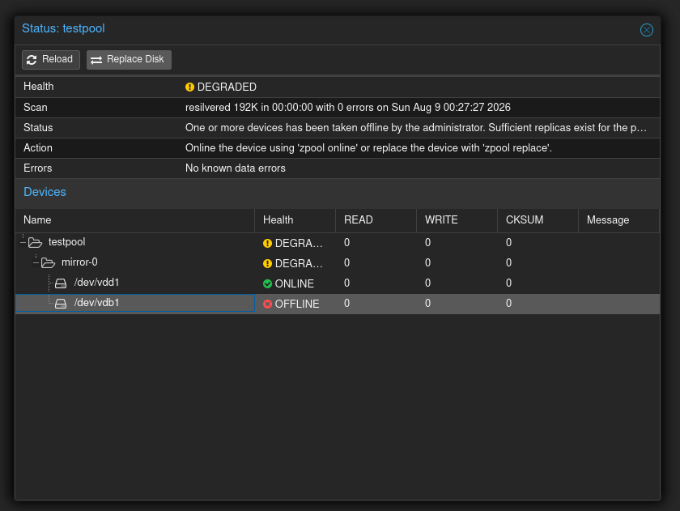
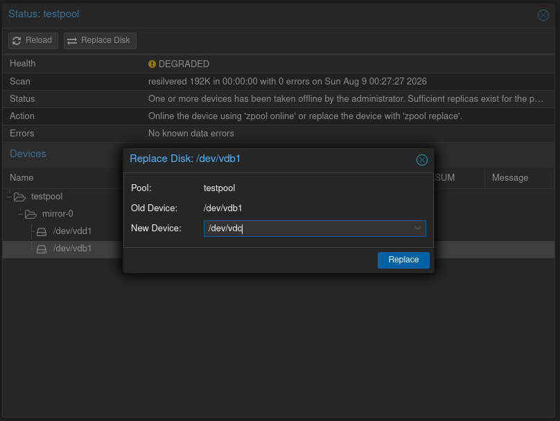

# pve-zfs-disk-replace

Adds a **"Replace Disk"** button to the Proxmox VE web interface, so you
can replace a failed or degraded ZFS drive without touching the command
line.




## Why

Today, replacing a ZFS drive in Proxmox VE requires SSH and manual
`zpool replace` commands - the GUI only lets you *see* that a pool is
degraded, not fix it. This has been requested since 2021 in
[bug #3289](https://bugzilla.proxmox.com/show_bug.cgi?id=3289) but was
never implemented upstream ("not a very important feature for PVE",
per a Proxmox developer). This project adds it.

**Not an official Proxmox feature** - a patch you apply yourself, in the
same spirit as the
[Proxmox VE Helper-Scripts](https://github.com/community-scripts/ProxmoxVE).
Source changes, for review: [pve-storage](https://github.com/jonathan-pp/pve-storage/compare/master...add-zfs-disk-replace) · [proxmox-widget-toolkit](https://github.com/jonathan-pp/proxmox-widget-toolkit/compare/master...add-zfs-disk-replace)

## Install

Run as root, directly on the Proxmox VE node:

```
bash -c "$(curl -fsSL https://raw.githubusercontent.com/jonathan-pp/pve-zfs-disk-replace/main/install.sh)"
```

Then go to **Datacenter > your node > Disks > ZFS**, open a pool's
**Detail** view, select the failed/degraded device, and click
**Replace Disk**.

## Uninstall

```
bash -c "$(curl -fsSL https://raw.githubusercontent.com/jonathan-pp/pve-zfs-disk-replace/main/uninstall.sh)"
```

## Safety

`install.sh` never overwrites blindly. It checks that the files it's
about to touch still match the exact Proxmox version this patch was
written against - if a Proxmox update changed them, it stops and does
nothing instead of guessing. Safe to run more than once.

## Caveats

- ZFS only - hardware RAID and mdadm aren't managed by Proxmox's storage
  stack, so they're out of scope.
- Written against Proxmox VE 9.2. A future Proxmox VE release may need
  an update here (see Safety above - it will tell you, not corrupt
  anything).
